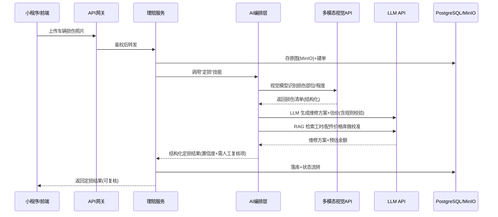

# 保险理赔 + 车后市场 AI 产品 规划书 v1

> 部署形态：Linux 服务器（CPU）　技术路线：商业 API 编排　日期：2026-06

---

## 0. 执行摘要（一页纸）

| 维度 | 方案 |
|------|------|
| 产品 A | **保险理赔 AI**：视觉定损 + 单证 OCR + 全流程理赔助手 |
| 产品 B | **车后市场 AI**：门店 SaaS + 配件供应链 + 维保/二手车档案 + 导修客服 + 技师辅助 |
| 架构核心思想 | **一套底座，两个产品**：共享 用户/车辆/单证/工作流/AI编排/数据层，上层挂各自产品域 |
| AI 路线 | 调用国内商业 API（LLM / 多模态视觉 / OCR / 语音），服务器只做编排，**不需要 GPU** |
| 后端技术栈 | Python 3.11 + FastAPI（统一语言，AI 编排顺手，招聘成本低） |
| 数据层 | PostgreSQL(+pgvector) + Redis + MinIO + Celery + Temporal(工作流) |
| 前端 | Web 后台(React+Ant Design) + 微信小程序(拍照/接单/车主侧) |
| 部署 | Docker Compose（单机起步）→ K8s（规模化后）；Nginx 入口 |
| 首发里程碑 | 先做 **理赔 MVP**：OCR + 视觉定损闭环（价值最直接、风险最聚焦） |
| 预计成本 | 服务器月 ~¥800-2000；商业 API 按 token/次计费，MVP 期月 ~¥3k-1w |

---

## 1. 产品定义

### 1.1 产品 A：保险理赔 AI

| 模块 | 核心能力 | 关键 AI 能力 |
|------|----------|--------------|
| **视觉定损** | 拍照上传 → 识别损伤部位/程度 → 维修方案 + 估价 | 多模态视觉模型（损伤检测）+ 结构化输出 |
| **单证 OCR + 录入** | 行驶证/驾驶证/保单/银行账户/医疗发票 → 结构化录入 | OCR API + LLM 字段抽取与校验 |
| **全流程理赔助手** | 报案→查勘→定损→理算→核赔→赔付 的智能编排 | LLM 工作流编排 + 条款 RAG + 决策辅助 |

### 1.2 产品 B：车后市场 AI

| 模块 | 核心能力 | 关键 AI 能力 |
|------|----------|--------------|
| **维修门店 SaaS** | 接单/派工/报价/库存/结算一体化 | LLM 辅助报价、智能派工 |
| **配件供应链** | VIN→OE 件号→替换件号匹配、寻源、比价、库存预测 | 知识图谱/RAG 配件目录、LLM 比价 |
| **维保/二手车档案** | 聚合维保记录 → 车辆健康报告 / 二手车车况评估 | LLM 报告生成、评分模型 |
| **智能客服/导修** | 车主故障咨询、维修方案推荐、预约 | LLM 对话 + 维修知识库 RAG |
| **技师辅助** | 故障诊断辅助、维修手册问答、工时标准推荐 | LLM + 车型手册 RAG + 诊断推理 |

### 1.3 两产品的复用点（为什么合并底座）

> 共享约 **60%** 的底层能力，独立部分仅在上层产品域。

```
共享底座：账户/组织、车辆档案、单证中心、文件存储、
         通知中心、工作流引擎、计费/额度、开放 API、AI 编排层
```

---

## 2. 总体架构

### 2.1 分层架构

```
┌────────────────────────────────────────────────────────┐
│  接入层：微信小程序 / H5 / Web 后台 / 开放 API          │
├────────────────────────────────────────────────────────┤
│  网关层：Nginx + API 网关（鉴权 / 限流 / 计费 / 日志）   │
├────────────────────────────────────────────────────────┤
│  产品域：                                                │
│   理赔域(报案/查勘/定损/理算/赔付)  │  车后域(门店/配件/  │
│                                    │  档案/导修/技师)   │
├────────────────────────────────────────────────────────┤
│  共享平台底座：                                          │
│   账户·组织 │ 车辆档案 │ 单证中心 │ 工作流引擎 │ 通知   │
│   计费·额度 │ 审计日志 │ 开放 API │ 权限(RBAC)          │
├────────────────────────────────────────────────────────┤
│  ★ AI 编排层（核心差异化）：                              │
│   Prompt/技能管理 │ RAG 检索 │ 多模型路由 │ 工具调用     │
│   视觉定损 │ OCR 抽取 │ 智能客服 │ 文档理解 │ 流式输出   │
├────────────────────────────────────────────────────────┤
│  外部商业能力（按需调用，按量计费）：                      │
│   LLM(通义/DeepSeek/GLM/豆包) │ 多模态视觉 │ OCR        │
│   语音(讯飞/阿里) │ 短信 │ 地图 │ 实名/风控             │
├────────────────────────────────────────────────────────┤
│  数据层：PostgreSQL(+pgvector) │ Redis │ MinIO │ 向量库  │
└────────────────────────────────────────────────────────┘
```

### 2.2 请求链路（以"视觉定损"为例）



### 2.3 为什么 CPU 服务器就够了

- 大模型/视觉/OCR **全部走外部 API**，服务器只发 HTTP 请求，CPU 负载低
- 服务器只承担：业务逻辑、API 编排、数据库、文件存储、工作流——全是 CPU/IO 密集，无 GPU 需求
- **省钱 + 合规数据可控**：敏感数据（保单、证件）可选本地脱敏后再送 API

---

## 3. 技术选型与理由

| 层 | 选型 | 理由 |
|----|------|------|
| 后端语言 | **Python 3.11** | AI 编排生态最好（SDK/LangChain），团队统一一种语言降成本 |
| Web 框架 | **FastAPI** | 异步、性能好、自动文档、与 AI 场景契合 |
| ORM | **SQLAlchemy 2.0 + Alembic** | 主流、迁移管理成熟 |
| 主库 | **PostgreSQL 16** | 关系型 + JSONB + 扩展能力强 |
| 向量库 | **pgvector**（起步）→ Milvus（量大后） | 先复用 PG 省组件，够用再换 |
| 缓存/队列 | **Redis 7** | 缓存 + Celery broker + 限流 |
| 对象存储 | **MinIO**（自建）或阿里 OSS | 图片/单证/PDF，MinIO 自建省钱可控 |
| 异步任务 | **Celery** | OCR/定损异步化、重试、定时 |
| 工作流引擎 | **Temporal**（推荐）或 状态机 | 理赔全流程长链路编排、可重放、可补偿 |
| API 网关 | **Nginx + Kong/APISIX**（可选） | 鉴权、限流、多租户、计费 |
| Web 前端 | **React + Ant Design Pro** | 后台管理类系统首选 |
| 移动端 | **微信小程序**（uni-app） | 理赔拍照、门店接单、车主侧，国内首选 |
| 部署 | **Docker + Docker Compose** | 单机起步，一键起所有服务 |
| 监控 | **Prometheus + Grafana** | 指标 + 告警 |
| 日志 | **Loki + Promtail**（轻量）或 ELK | 比起 ELK 更省资源 |
| CI/CD | **Git + GitLab CI / GitHub Actions** | 自动构建镜像、部署 |

### 商业 API 选型（国内，按需多供应商备份）

| 能力 | 首选 | 备选 | 说明 |
|------|------|------|------|
| LLM（通用） | 通义千问 / DeepSeek | GLM / 豆包 | 性价比 + 上下文长，DeepSeek 适合推理 |
| 多模态视觉 | 通义千问 VL / GPT-4o 类 | GLM-4V | 定损损伤识别，需支持图像+指令 |
| OCR（通用+票据） | 阿里云 OCR / 腾讯云 OCR | 百度 OCR | 证件/发票/通用文字成熟 |
| 语音（可选） | 科大讯飞 / 阿里 | — | 查勘语音转写 |
| 短信/实名/地图 | 阿里云 | 腾讯云 | 通知、定位、风控 |

> **建议建一个「模型路由层」**：同一能力多家供应商，按价格/质量/可用性动态路由 + 熔断降级。

---

## 4. 关键模块设计

### 4.1 ★ AI 编排层（最关键，是产品的护城河）

把"调 API"封装成可管理的**技能(Skill)系统**，避免散落在业务代码里：

```
AI 编排层
├── Skill 注册表：定损 / OCR抽取 / 客服问答 / 报告生成 / 配件匹配 ...
├── Prompt 管理：版本化、A/B、模板变量、多模型适配
├── RAG 引擎：知识库(条款/手册/配件目录) → 切分 → 向量化 → 检索 → 注入
├── 工具调用(Function Calling)：调价格库、查 VIN、查保单
├── 多模型路由：按 skill 选模型，按成本/延迟/可用性切换供应商
├── 输出校验：JSON Schema 校验 + 规则引擎兜底（金额、件号格式）
├── 全链路追踪：每次调用记录 prompt/response/cost/耗时/置信度
└── 人工复核(HITL)：低置信度结果自动转人工，闭环学习
```

**为什么这是护城河**：API 人人会调，但 **Prompt 工程 + RAG 知识库 + 输出校验 + 复核闭环 + 持续标注优化** 才是行业 know-how。

### 4.2 单证 OCR + 录入

```
图片/PDF → 预处理(纠偏/增强) → OCR API(文本) → LLM 字段抽取
         → Schema 校验 → 规则校验(身份证位、金额) → 入库 → 人工复核
```
- 支持单据类型：行驶证、驾驶证、保单、银行卡、医疗发票、维修清单
- LLM 做"非结构化文本→结构化字段"，比纯 OCR 模板适配性强

### 4.3 视觉定损

```
多张照片 → 图像质量检测(模糊/反光/是否对准部位) → 视觉模型损伤识别
        → 损伤清单(部位/类型/程度) → 工时+配件价格库校准 → 估价
        → 置信度判定 → 高置信直通 / 低置信转人工定损员
```
- 关键：**损伤 → 价格** 需要 RAG 接工时标准和配件价格库（这是行业壁垒）

### 4.4 理赔全流程（工作流引擎）

用 Temporal 定义长流程，每步可暂停/可补偿/可人工介入：

```
报案 → 调度派工 → 现场查勘 → 定损 → 核损 → 理算(按条款) → 核赔 → 支付 → 结案
```
- 每个节点可挂"AI 辅助"（查勘提示、理算计算、材料检查清单）
- 异常分支：补材料、人伤、争议、欺诈告警

### 4.5 配件供应链（车后难点）

```
VIN 码 → 解析车型 → OE 原厂件号 → 匹配品牌件/副厂替换件号
       → 多供应商询价比价 → 库存可用性 → 推荐方案
```
- AI 价值：件号匹配的知识库 + RAG + LLM 容错（同义词、别名、年代差异）

---

## 5. 数据模型概要

核心实体（两产品共享）：

```
账户 account ─┬─ 用户 user（C 端）
              └─ 员工 staff（B 端，属组织 organization）
组织 organization（保险公司 / 修理厂 / 经销商）
车辆 vehicle（VIN、车型、车主关联）
单证 document（类型、文件、抽取字段 JSONB、状态、置信度）
案件/工单 case ─┬─ claim_case（理赔案）
               └─ service_order（维修工单）
任务 task（异步/工作流）
ai_call_log（全链路：skill/model/prompt/response/cost/latency/置信度）
knowledge_base / knowledge_chunk（条款、手册、配件、价格库）
```

---

## 6. Linux 服务器部署方案

### 6.1 推荐配置（首发，单机）

| 项 | 配置 | 说明 |
|----|------|------|
| CPU | 8~16 核 | 业务+编排，无 GPU 需求 |
| 内存 | 32~64 GB | PG/Redis/MinIO/Temporal 都要吃内存 |
| 系统盘 | 100 GB SSD | 系统+应用 |
| 数据盘 | 500 GB~1 TB SSD | 数据库 + 对象存储（照片多） |
| 带宽 | 5~10 Mbps 起步（按量可弹性） | 图片上传是主要消耗 |
| OS | Ubuntu 22.04 LTS / CentOS Stream | 长期支持 |

> 云厂商：阿里云/腾讯云 ECS，或自建物理机。MVP 用一台 8C32G 起步即可，~¥800-1500/月。

### 6.2 Docker Compose 服务清单（首发）

```yaml
# 单机一键起：nginx, api, worker(celery), temporal,
# postgres, redis, minio, prometheus, grafana, loki
```
所有组件容器化，`docker compose up -d` 起全栈。数据用 volume 持久化，定期备份到对象存储/异地。

### 6.3 运维要点
- HTTPS（Let's Encrypt）、防火墙仅放必要端口
- 数据库每日全量 + WAL 增量备份，异地留存
- 密钥用 `.env` / Vault 管理，**不入库不进镜像**
- 健康检查 + 自动重启 + 告警（Prometheus alertmanager）
- 灰度发布：先小流量验证 AI 效果再放量

---

## 7. 开发路线图（分里程碑）

### Phase 0｜基建 + 验证（1~2 周）
- 服务器初始化、Docker 环境、CI/CD 骨架
- 商业 API 接入跑通（LLM / OCR / 视觉 各一个 PoC）
- 技术栈脚手架：FastAPI + PG + Redis + MinIO + 前端框架
- **产出**：可行性验证 + 架构定稿

### Phase 1｜★ 理赔 MVP（1.5~2 个月）
**目标：跑通"拍照→定损估价"+"单证 OCR 录入"最小闭环**
- AI 编排层 v1（Skill + Prompt 管理 + 模型路由）
- 单证 OCR + 录入（行驶证/驾驶证/发票）
- 视觉定损（损伤识别 + 估价 + 人工复核）
- 车辆/单证/案件底座、Web 后台 + 小程序上传
- **产出**：可在试点单位试用的理赔辅助工具

### Phase 2｜理赔全流程 + 车后 MVP（2~3 个月）
- 理赔全流程工作流（Temporal）+ 条款 RAG 理算辅助
- 车后：门店 SaaS（接单/派工/报价/结算）+ 配件匹配 MVP
- 计费/多租户/权限/RBAC 完善
- **产出**：两产品均可对外交付

### Phase 3｜车后深化 + 智能化（持续）
- 维保/二手车档案与评估、导修客服、技师辅助
- 知识图谱（配件/故障/车型）、模型路由优化、复核闭环学习
- 开放 API、生态对接（保险公司核心系统、ERP）
- 规模化：Docker Compose → K8s

---

## 8. 团队与人力建议（参考）

| 角色 | 人数 | 阶段 |
|------|------|------|
| 后端工程师（Python） | 2 | Phase 0 起 |
| 前端工程师（Web+小程序） | 1~2 | Phase 1 起 |
| AI / Prompt 工程师 | 1（可后端兼任） | Phase 1 起 |
| 产品/业务（保险+车后） | 1 | 全程，**很关键**（行业 know-how） |
| 测试/运维 | 1（可兼任） | Phase 1 起 |

> MVP 期 3~5 人即可启动。**业务专家比技术人手更稀缺**，保险条款和配件体系的 know-how 是成败关键。

---

## 9. 成本估算（MVP 期，月）

| 项 | 估算 | 说明 |
|----|------|------|
| 服务器（8C32G+数据盘） | ¥800~1500 | 单机起步 |
| 商业 API | ¥3,000~10,000+ | 随调用量增长，可控 |
| 短信/存储/带宽 | ¥500~2000 | 看量 |
| 人力 | — | 按团队 |

> **成本控制点**：模型路由（贵任务用贵模型、简单任务用便宜模型）、Prompt 缓存、RAG 召回过滤、结果缓存。

---

## 10. 风险与合规

| 风险 | 应对 |
|------|------|
| **数据合规**（保单/证件/医疗） | 敏感字段本地脱敏后再送 API；签 DPA；数据加密存储；遵循《个保法》《数据安全法》 |
| AI 输出错误（定损/理算金额） | 强制 JSON Schema + 规则引擎校验 + 人工复核闭环 + 审计留痕 |
| 商业 API 依赖/涨价/宕机 | 多供应商路由 + 熔断降级 + 关键能力可切换 |
| 行业 know-how 不足 | 早期引入保险定损员 + 配件专家，持续标注优化 |
| 业务系统对接（保司核心系统） | 预留开放 API + 适配层，标准化对接协议 |
| 规模化瓶颈 | 架构从设计就支持从 Compose 平滑迁 K8s |

---

## 11. 下一步行动（立即可做）

1. **确认团队与技术栈**（本文档为基线，可调整）
2. **开服务器**：申请 8C32G ECS + 数据盘，初始化 Docker 环境
3. **开通商业 API**：先开通 通义/DeepSeek + 阿里 OCR，拿 key 做 PoC
4. **建仓库**：`carwork` → 拆 `carwork-platform`(底座) / `carwork-claims`(理赔) / `carwork-aftermarket`(车后) / `carwork-ai`(编排) / `carwork-web` / `carwork-mp`
5. **Phase 0 PoC**：一周内跑通"上传一张证件→OCR→结构化"和"上传车损照片→识别损伤"两条链路
6. **锁定试点单位**：找 1 家修理厂/保司分支做 MVP 验证场景

---

*本文档为 v1 规划基线，随 Phase 0 验证结果迭代。*
